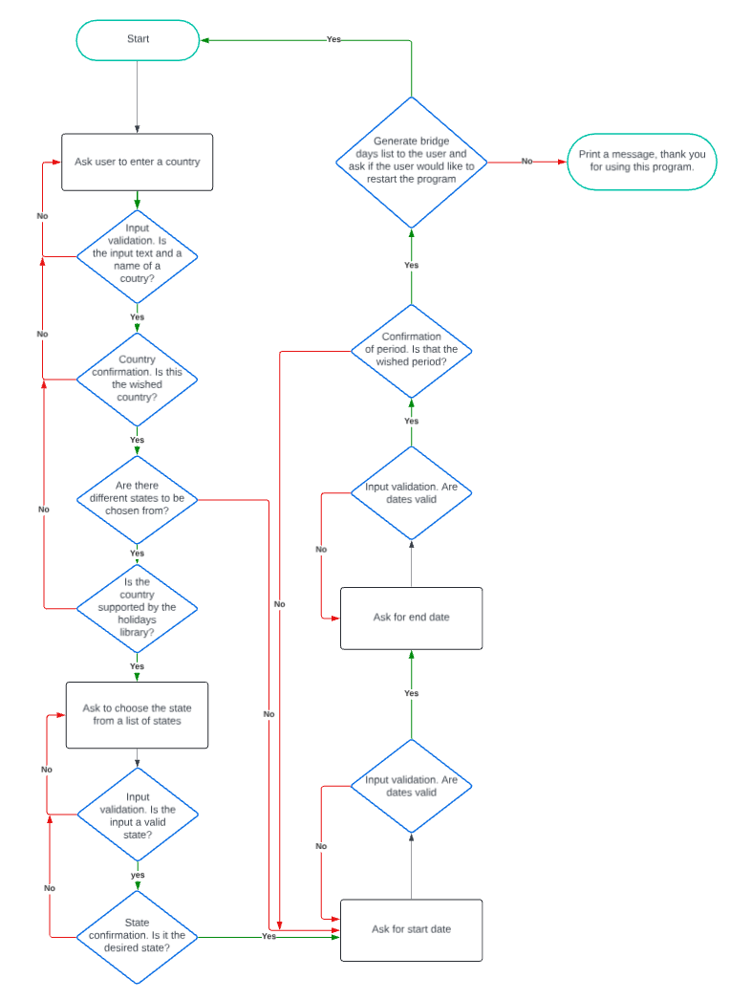

# Holidays Optimizer

The "Holidays Optimizer" is a user-friendly program designed to help the user make the most out of their vacation days. It cleverly identifies public holidays within a given time frame and suggests the best days to take off from work. This way, regular holidays can be extended into longer breaks. The program is especially useful to maximize time off without using up too many leave days. By aligning vacation with existing public holidays, and considering weekends, it helps to achieve longer periods of leisure.

Visit the deployed program: [Holidays Optimizer](https://holidays-optimizer-02bf64773985.herokuapp.com/) - ***Use Ctrl (Cmd) and click to open in a new window.*** 

## Contents

- [Introduction](#introduction)
- [User Experience](#user-experience)
    - [User Goals](#user-goals)
- [Creation Process](#creation-process)
    - [Project Planning](#project-planning)
    - [Flowchart](#flowchart)
    - [Development](#development)
    - [Design Choices](#design-choices)
- [Features](#features)
    - [Wait for a Keypress](#wait-for-a-keypress)
    - [Short introduction](#short-introduction)
    - [Autocomplete](#autocomplete)
    - [Validation of Entered Data](#validation-of-entered-data)
    - [Confirmation After Each Input](#confirmation-after-each-input)
    - [Clear Display of Results](#clear-display-of-results)
    - [Restart Option](#restart-option)
    - [Thank You Message](#thank-you-message)
    - [Known Limitations and Future Features](#known-limitations-and-future-features)
- [Technologies Used](#technologies-used)
    - [Languages Used](#languages-used)
    - [Programs Used](#programs-used)
    - [Libraries Used](#libraries-used)
- [Deployment and Local Deployment](#deployment-and-local-deployment)
    - [Deployment](#deployment)
        - [Heroku](#heroku)
    - [Local Deployment](#local-deployment)
        - [How to Fork](#how-to-fork)
        - [How to Clone](#how-to-clone)
- [Testing](#testing)
- [Fixed bugs](#fixed-bugs)
- [Existing bugs](#existing-bugs)
- [Credits](#credits)
    - [Code](#code)
    - [Content](#content)
    - [Acknowledgments](#acknowledgments)

## Introduction

This program assists users in planning their vacation time by identifying public holidays within a specified period and suggesting optimal days for taking time off. Its goal is to maximize extended breaks around these holidays.

## User Experience 
  
### User Goals
- As a user, I want an attractive and engaging application.
- As a user, I want clear instructions provided throughout the application.
- As a user, I want feedback confirming my choices of country, state, and selected period.
- As a user, I want to be able to re-enter data entered by mistake during the process without having to restart the program.
- As a user, I want a clear and sorted output of the suggested vacation dates.

## Creation Process   

### Project planning

My idea for this project was to develop a program that, when provided with user-specified dates, automatically pinpoints public holidays and recommends bridge days, which are strategically chosen to effectively prolong holiday breaks, to be taken as vacations optimizing the break periods by using less vacation.

Reseraching online I found that in order to offer the product to a wider range of users, I have decided to use a [holidays library](https://pypi.org/project/holidays/) available for Python, which includes holidays from many different countries.

 My main goals for the application were to:

- Obtain location input from the user, including country and state/province or territory (depending on the availability of those in the holidays library).
- Gather start and end dates from the user to generate a list of holidays within the specified period.
- Implement input validation to ensure that no empty spaces or inappropriate date formats or date ranges are accepted.
- Produce clear output with a sorted list of dates, serving as suggestions for vacation dates.

### Flowchart   
To help with planning my project, I used [Lucidchart](https://www.lucidchart.com/pages/) to produce a flowchart and organize the flow of the program.

  

### Development

I began by developing functions to collect user input for the country and state (if available).

Since I intended to utilize the holidays library to retrieve holidays based on the country input, ensuring accurate results required obtaining the country abbreviation in accordance with the ISO 3166-1 alpha-2 code, as outlined in the [library's documentation](https://pypi.org/project/holidays/). At the same time I wanted to enhance user-friendliness and enable input of country names, I therefore created a separate file containing a dictionary that mapped country names to their respective abbreviations and another one which listed countries with available lists of states within the library to be used by the functions on the program.

I relied on the flowchart as my guide throughout the development process, ensuring that each function worked properly and that validations were effectively implemented at every step.

After implementing the functions to obtain the country, state, and dates from the user, I decided to incorporate an additional confirmation step after each input. This way, users wouldn't need to restart the program in case of accidental input errors.

After some consideration, I also decided not to include the previously planned prompts for the number of days and the option for month or period. These data wouldn't contribute significantly to achieving the desired result.

With these changes during the process the resulting flowchart was slightly changed.

For the main logic of how the program should work, I sketched out three consecutive weeks on paper to map out the various possibilities based on which day of the week the holiday falls on. Initially, my plan was to offer different suggestions, including one and two days around the public holidays, regardless of which workdays they fall on.

For example, if a holiday falls on a Tuesday, the suggestions would not only include the preceding Monday but also additional days such as Monday and Wednesday, allowing for an extended break of five days by taking two days off.

Allways having in mind that the duration of the extended break, which includes both public holidays and vacation days, should be at least twice as long as the number of suggested vacation days.

Additionally, the suggestions would include the option of taking Friday of the preceding week off as well as the subsequent Monday. The suggestions also included four days on special scenarios where there are holidays on both a Friday and the subsequent Monday, resulting in a 10 days break by taking only four vacation days.

The scheme below illustrates the sketches I created. The blue indicates the weekend days (Saturday and Sunday). The orange marks the various possibilities for holidays on different weekdays, while the green represents the suggested vacation days to extend the work break period. Light green would be the alternative of additional suggestions to further extend the breaks by taking an extra day. The code reflected this strategy literaly, so, the program would check for public holidays within the entered period and if the holiday was on a Monday, suggest Tuesday or Friday of previous week for a one day vacation required for a total of four days break; Monday and Friday or Thursday and Friday of the previous week or Tuesday and Wednesday for a five day break using two vacation days. The same logic was applyed for all days of the week.

After developing and testing the program based on this logic, it became apparent to me that the resulting output contained excessive information, which, although easy to comprehend, lacked simplicity and could be overwhelming for the user. Additionally, I felt that it was deviating slightly from the main objective of identifying bridge days between public holidays and weekends to extend free time. At that time, a few issues arose:

The program failed to consider the distances between holidays, sometimes suggesting vacation days that coincided with existing public holidays.
If a public holiday fell very close to the range of days entered, some suggestions could potentially extend beyond the specified range.

In the picture below, on the left, the result provided by the program can be observed, while on the right, the suggested dates are highlighted on a calendar. The "bridge" days are marked in green, alternative extra days in blue, and dates that were already public holidays are highlighted in red. Additionally, the dates marked in red on the results list on the left are those that fall outside the provided range.

When I began thinking about how to address the issues, it became increasingly evident that my code required refactoring with a different approach. This decision was far from easy, given the considerable energy invested in planning and developing the initial logic. However, I opted to revise my approach and re-think the whole strategy. This time I considered the weekends and public holidays as non working days and looked for how many workdays were present between two non working days during the given period.

The scheme below illustrates this revised concept, employing the same color scheme as described in the first logic.

The outcome of the new approach (picture below) was significantly more straightforward, clear, and easy to understand, making more sense in its presentation. While it could be argued that fewer days are being suggested, I believe this method aligns more precisely with the users expectations when using such a tool.

## Design Choices

As this project focused on back-end programming, I, a student of the [Code Institute](https://codeinstitute.net/ie/), did not undertake front-end production myself. The command-line interface (CLI) code was provided through the use of CI's [Python Essentials template](https://github.com/Code-Institute-Org/python-essentials-template), and I chose not to modify the HTML or JavaScript code, maintaining the original interface design. The CLI application displayed within an 80-character window with a vertical scrollbar.

ASCII art was used using the [pyfiglet module](https://pypi.org/project/pyfiglet/) for the program's logo at the start of the program as described [here](https://www.geeksforgeeks.org/python-ascii-art-using-pyfiglet-module/) using the font "doom".

### Colors scheme

The [Rich python library](https://rich.readthedocs.io/en/stable/introduction.html) was utilized to craft a vibrant and engaging user interface. Colors were incorporated to aid in localization during program execution on the CLI, as well as to provide visual feedback.

By establishing a consistent color scheme throughout the application, users can predict what to expect. This predictability enhances usability and overall user experience.

#### Green

All feedback of choices and results are printed in green. The color green is commonly linked with positivity, success, and affirmation. By employing green for feedback messages, the application provides a clear and unmistakable signal of valid choices made by the user. This assists users in distinguishing between successful interactions and potential errors or warnings with ease.

#### Yellow

Yellow was used when listing the states of a country because it is a color that stands out among several white lines in the CLI.

Yellow was also utilized for feedback indicating that no holidays were present during the selected period, distinguishing it from the green feedback message used when listing the holidays and vacation day suggestions.

#### Red

Any input provided by the user that fails validation will result in an 'Error' message printed in red. This provides the user with feedback to pay close attention to their input, as invalid data will prevent them from proceeding with the operations.

#### Cyan

The dates are automatically displayed in cyan and this configuration was left unchanged to allow the dates to stand out from the rest of the content.

## Features

### Wait for a keypress

The size of the CLI application is limited, so to allow the user to see the ASCII art, I used a handy feature: an input function that waits for the user to press 'Enter' before the screen scrolls down and the first prompt appears.

### Short introduction

A welcome message and short introduction preceed the first prompt giving a short overview of the program

### Autocomplete

To enhance user experience during country selection, I implemented autocomplete functionality using the [Python Prompt Toolkit](https://python-prompt-toolkit.readthedocs.io/en/master/) library. This feature enables users to efficiently choose a country from a dropdown list using arrow keys or the Tab key on the keyboard. Additionally, it significantly reduces the likelihood of typing errors.

### Validation of entered data

After the user provides information as prompted by the program, this input is subjected to a validation process to confirm its correctness before proceeding. In cases where the input is invalid, such as an empty field or a numerical entry where text is expected, the error is identified, and the user receives a clear message explaining the discrepancy. Subsequently, they are prompted to re-enter the information correctly. A few examples of error messages are depicted below.

### Confirmation after each input

After input validation, the user receives a confirmation message along with the option to either revise their choice or confirm it. This step enhances the user experience by allowing corrections without the need to restart the program.

### Clear display of results

The results are displayed in a concise, clear, and understandable format. The holidays for the selected country are listed, followed by the suggested vacation days to be taken off in order to maximize the work break time. The suggested periods for block leave are presented as lines of dates, separated by commas. Additionally, these blocks of suggestions are thoughtfully sorted by date for easy reference.

### Restart option

After receiving the results for an inquiry, the user is presented with the option to either initiate a new inquiry or conclude the program. This feature was incorporated to offer sense of control, accommodating users who have multiple queries without the need to restart the program, while also providing a straightforward way to exit for those who have completed their task. It streamlines the user experience, making the application more efficient and user-friendly.

### Thank you message

A short thank you message was added to provide a personal touch and to mark a clear end to an interaction, giving a sense of closure to the user's experience.

### Known Limitation and Future Feature

Not all countries have Saturday and Sunday as weekend days. Some countries have Friday and Saturday, while others have Thursday and Friday as their weekends. Consequently, a valuable future feature would be to incorporate the ability to select from these varying weekend options.

## Technologies Used

### Languages used

   - HTML5 - provide within the Code Institute's [Python Essentials template](https://github.com/Code-Institute-Org/python-essentials-template) 
   - JavaScript - same as above.
   - Python - Python code written is my own with insights from ChatGPT at OpenAI.

### Programs Used
   - [Lucidchart](https://www.lucidchart.com/pages/) - used to create the flowchart needed during project planning.
   - [GitHub](https://github.com/) - used for hosting the program's source code.
   - [VSCode](https://code.visualstudio.com/) - used as a workspace for developing the code and testing the program.
   - Git - used for version control.
   - [Heroku](https://heroku.com/apps) - used for deploying the project.
   - [PEP8 Validator](https://pep8ci.herokuapp.com/#) - used for validating the Python code.
   - [Tiny PNG](https://tinypng.com/) - used to compress images.

### Libraries Used
 - [holidays](https://pypi.org/project/holidays/) - To get the holidays by country
 - [datetime](https://docs.python.org/3/library/datetime.html) - To work with dates
 - [pyfiglet](https://pypi.org/project/pyfiglet/) - For the ASCII art
 - [rich](https://rich.readthedocs.io/en/stable/introduction.html#) - To add color to the text
 - [prompt_toolkit](https://python-prompt-toolkit.readthedocs.io/en/master/) - For the autocomplete

## Deployment and Local deployment:

### Deployment

#### Heroku

The Application has been deployed from GitHub to Heroku by following the steps:

1. Create or log in to your account at heroku.com
2. Create a new app, add a unique app name and then choose your region
3. Click on create app
4. Go to "Settings"
5. Under Config Vars add a key 'PORT' and value '8000'.
6. Add required buildpacks. Set it up so Python will be on top and Node.js on bottom
7. Go to "Deploy" and select "GitHub" in "Deployment method"
8. To connect Heroku app to your Github repository code enter your repository name, click 'Search' and then 'Connect' once it is found.
9.  Choose the branch you want to build your app from
10. Either choose to deploy manually by clicking "Deploy Branch" or click on "Enable Automatic Deploys", which keeps the app up to date with your GitHub repository
11. Wait for the app to build. Once ready you will see the “App was successfully deployed” message and a 'View' button to take you to your deployed link.

The live link can be found here - [Holidays Optimizer](https://holidays-optimizer-02bf64773985.herokuapp.com/)

### Local Deployment

#### How to Fork

To fork the repository:

  - Log in (or sign up) to Github.
  - Go to the repository for this project, [pswhdev/holidays_optimizer](https://github.com/pswhdev/holidays_optimizer)
  - Click the Fork button in the top right corner.

#### How to Clone

To clone the repository:

  - Log in (or sign up) to GitHub.
  - Go to the repository for this project, [pswhdev/holidays_optimizer](https://github.com/pswhdev/holidays_optimizer)
  - Click on the code button, select whether you would like to clone with HTTPS, SSH or GitHub CLI and copy the link shown.
  - Open the terminal in your code editor and change the current working directory to the location you want to use for the cloned directory.
  - Type 'git clone' into the terminal and then paste the link you copied from the repository. Press enter.

## Testing

Please refer to [TESTING.md](TESTING.md) file for details on all testing conducted.

## Fixed bugs
1. When a country that does not have a list of states available in the library, an error occurred. To solve the issue, I modified the specify_state function to return None if there were no states to be selected from. Additionally, I assigned selected_state as None by default in the functions that had a state as a parameter.

2. After being prompted to confirm the choice of period and pressing "n" and entering new dates, I noticed that the same dates chosen on the first prompt were being printed on the terminal for confirmation instead of the new dates. This issue occurred because the dates weren't being returned in the "no" block of the confirmation function. To address this problem, I modified the return statement within the function to include the newly selected dates. Additionally, I added the lines "start_date, end_date = validate_dates(start_date, end_date)" and "start_date, end_date = confirm_dates(start_date, end_date)" to the main() function. This ensures that the main function receives the validated and confirmed dates directly from their respective functions, allowing them to be used for the next steps of the code.

3. After receiving feedback from peer reviewers, I decided to split the functions for obtaining, validating, confirming dates, and handling newly chosen dates. This approach allows for handling wrong inputs on the end day separately from the start date, thereby improving the user experience. Previously, the user was prompted to choose the start date again even if the start date was valid and correct, but the user had made a mistake while entering the end date.

4. During the testing phase, it was observed that the country wasn't changing after selecting another country, and the list of states was shown for the first country selected. To address this issue, I combined the two functions responsible for obtaining and confirming the country and state into one. This resulted in more concise code, and only one value would be returned to the main() function fixing the problem.

5. While I was testing the program, I noticed by chance that some countries, such as Sweden, have Sunday saved as a holiday in the holidays library. To address this, I added a condition within the function to exclude Sundays from the list of holidays if it is not specified as a holiday. However, there may be other countries with similar configurations, in which case Sundays will be listed as holidays when the function check_holidays runs.

6. While testing, I noticed that if I input a range of only one day, the program would suggest both the start date and end date as vacation days for time off optimization. To resolve this issue, I implemented a conditional to suggest dates only if public holidays are found during the selected period.

7. During testing, I encountered an issue where if I pressed "r" to make a new inquiry at the end of the program, it would run again. However, after the second time it ran, if I then chose "f" to finish the program, I would still get the message "thank you for using..." but I would be prompted again to press "r" or "f". To fix this, I removed the what_next() function from the main() function.

## Existing bugs
To the best of my knowledge, there are no bugs in the program.

## Credits

### Code

I used the following tutorials and documentation:
- https://www.geeksforgeeks.org/python-ascii-art-using-pyfiglet-module/ for the ASCII art for the logo.

- Tutorials on how to use the holidays library:
    - https://pypi.org/project/holidays/ - holidays documentation
    - https://www.javatpoint.com/python-holidays-module
    - https://www.geeksforgeeks.org/python-holidays-library/

- https://pieriantraining.com/how-to-wait-for-a-keypress-in-python/ - to create a "wait" for Enter to be pressed on the logo screen.

- https://www.geeksforgeeks.org/python-program-to-find-day-of-the-week-for-a-given-date/ - to find day of the week

- https://docs.python.org/3/library/datetime.html#strftime-and-strptime-behavior - to learn how to format the date to DD-MM_YYYY

- https://docs.python.org/3/library/datetime.html#timedelta-objects - to learn how to work with dates and days

-  ChatGPT from OpenAI was used to troubleshoot code when it was not working as expected, as well as to provide insights on how to achieve my intended goals when I encountered difficulties on my own. 

### Content

The documentation in the README file was inspired by README files authored by both Amy Richardson and Diane Corriette.

Text revisions were made with the assistance from ChatGPT.

### Acknowledgments

I would like to express my gratitude to:

- My family for testing the program and giving feedback.
- The Cohort Facilitators Kristyna Wach and Amy RichardsonMy as well as my fellow Code Institute students who have provided great support.
- Jubril Akolade, my mentor, for providing his support and guidance.

[Back to Top](#holidays-optimizer)