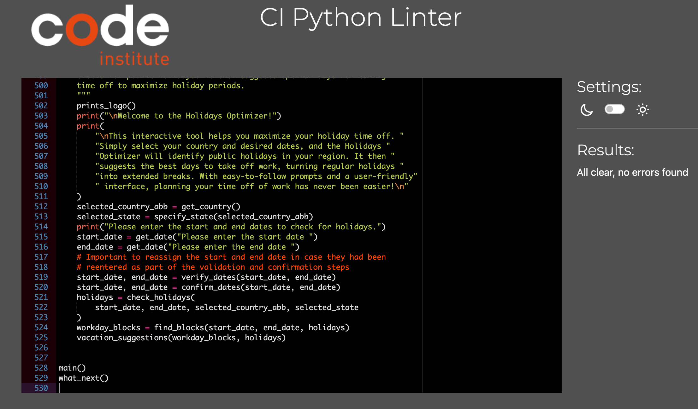

# Testing

## Validation

The code underwent validation using the Code Institute's Pep8 Linter with no errors detected. The validation result is provided below:

Validation has been implemented for all user inputs after each entry, to ensure no dead ends for the user or acceptance of invalid user input.

Since the HTML and JavaScript were provided through a specific template rather than being created by me, I have not conducted validation for those.

## Manual Testing

User input validation was carried out throughout the project build to ensure any possible errors that can be made were caught and properly handled.

Since I decided to use the external holidays library in the program, even though the countries dictionary I incorporated into my database is up-to-date with the library, there's a possibility that in the future a country might be removed from the library's list or countries might split and change names, among other potential changes. Therefore, I added a fictional country to the list to be able to catch and handle the error that would arise in a future scenario where a country is present in the program's list but is no longer on the library's list. After implementing the function to check if the country is supported by the library and testing to ensure the program handled the error as expected, the country has been removed from the list.

To test the results given by the program, I randomly chose three countries: Germany (Bayern), Sweeden and Bahamas with the start date of 01-01-2025 and end date 01-01-2026 and compared the results obtained with the program with a calendar generated by the [Time and Date](https://www.timeanddate.com/calendar/) website to visualy compare the suggested dates.

To visit the deployed project live link click [HERE](https://holidays-optimizer-02bf64773985.herokuapp.com/) - ***Use Ctrl (Cmd) and click to open in a new window.*** 

## User Stories

## Fixed bugs

## Existing bugs

[Back to README](README.md)